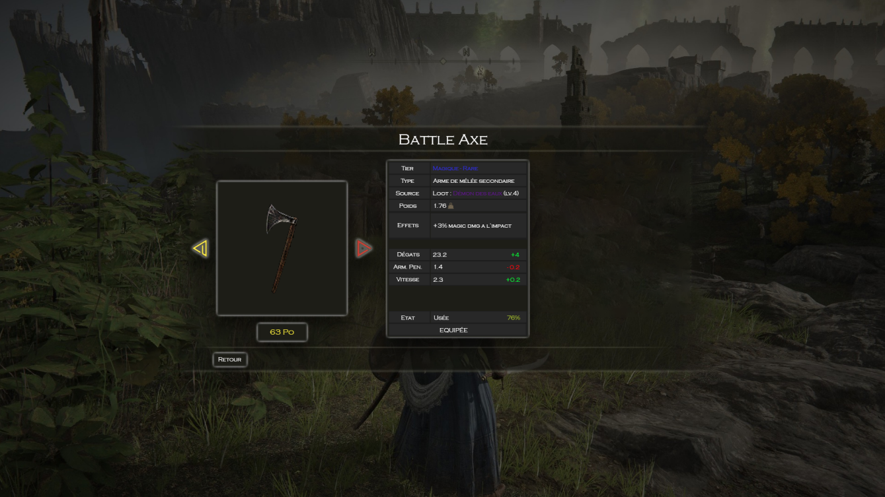

# Test Stagiaire Unity pour Smart Tale

## Prérequis

 - Vous devrez télécharger Unity3D version 2021.3.* LTS ou ultérieure
 - Il est préférable d'utiliser Visual Studio (fourni avec Unity)
 - Vous allez devoir utiliser git, vous trouverez le lien d'installation ici : https://git-scm.com/downloads
 - A l'heure qui aura été convenue vous recevrez un mail d'invitation au projet git, suivez les instructions qui vous seront alors fournies.
 - Il vous faudra ensuite cloner le projet : https://confluence.atlassian.com/bitbucket/clone-a-repository-223217891.html
 - Avant la fin du délai, placez vous dans le dossier du projet avec la console git et n'oubliez pas :
	 - d'ajouter vos fichier (https://git-scm.com/docs/git-add) :
    `git add .`
	 - de commiter vos  modifications (https://git-scm.com/docs/git-commit) :
    `git commit -m "Votre commentaire de commit"`
	 - de pousser vos modifications (https://git-scm.com/docs/git-push) :
    `git push`

&nbsp;  
## Carrousel d'arme

Vous allez devoir gérer un écran de visualization d'un ensemble d'armes d'un jeu de type RPG.

Le carrousel doit permetre l'affichage de plusieurs armes et afficher les caractéristiques de chaque arme.

Les caractéristiques minimales d'une arme sont :
- Nom de l'arme
- Sprite / Image de l'arme
- Prix de l'arme en pièces d'or (Po)
- Tier de l'arme :
    - Magique ou Physique
    - Rareté :
        - Commum (blanc)
        - Rare (bleu)
        - Epique (violet)
        - Légendaire (doré)
- Type d'arme
    - Principale ou Secondaire
    - Portée de l'arme :
        - Mêlée
        - Pugilat
        - Distance
- Poids de l'arme (Kg)
- Dégats de l'arme
- Pénétration d'armure de l'arme
- Vitesse de l'arme
- État / Durabilité de l'arme
    - Neuf (100%80% : couleur verte)
    - Usée (79%49% : couleur jaune)
    - Très usée (48%15% : couleur orange)
    - Fragile (14%1% : couleur rouge)
    - Cassée(0% : couleur grise)

&nbsp;  
Exemple de carrousel plus complet :

&nbsp;  
Le test se déroule en 2 parties obligatoires :

- Création d'un outil éditeur pour définir les caractéristiques des armes.
- Gestion de l'affichage et du comportement en jeu du carrousel d'arme.

&nbsp;  
### Outil de modification de caractéristiques des armes

L'outil de définition des caractéristiques des armes que vous devez compléter se base sur un [ScriptableObject](https://docs.unity3d.com/Manual/class-ScriptableObject.html).

Vous trouverez le fichier à compléter à cet emplacement : `Assets/Scripts/ScriptableObjects/WeaponData.cs`.

Une instance de ce ScriptableObject existe déjà dans le projet et se trouve à cet emplacement : `Assets/ScriptableObjects/WeaponData.asset`.

Vous devez écrire du code pour permettre d'ajouter toutes les caractéristiques des armes pour un nombre non défini d'armes. L'ajout se fait alors en ajustant l'inspecteur de l'instance du ScriptableObject `WeaponData.asset`.

N'hésitez pas à remplir votre outil avec plusieurs armes et leurs caractéristiques afin de tester que celui-ci fonctionne bien, on en aura également besoin pour la deuxième partie du test. Vous trouverez des exemples de sprites d'armes dans le dossier `Assets/Sprites`. Vous êtes libre d'importer d'autres images dans le projet si vous le voulez ou d'utiliser celles proposées.

Tout moyen utilisé qui permet de faciliter la tâche d'ajout ou d'ajustement de caractéristique est bienvenu et sera évalué très positivement.

&nbsp;  
### Affichage et comportement en jeu

Vous allez devoir gérer l'affichage et le comportement en jeu du carrousel.
Pour cela vous disposez de la scene `Assets/Scenes/MainScene.unity` qui contient patron pour débuter votre travail.

La scène contient un Canvas avec 2 menus, `MainMenu` et `WeaponVisualizerMenu` qui sont respectivement le menu de départ et le menu qui contient le carrousel.

Le comportement est le suivant : 
Quand le jeu se lance, le joueur arrive sur le main menu, quand il clique le bouton présent il est amené sur carrousel qui à la première arme de sélectionnée. 
Sur le menu du carrousel, le joueur peut : 
 - Passer à l'arme précédente (bouton `<`)
 - Passer à l'arme suivante (bouton `>`)
 - Retourner au main menu (bouton `Retour`)

Lors d'un changement d'arme le carrousel doit se mettre à jour et afficher les bonnes caractéristiques.

&nbsp;  
Vous êtes absolument libre d'utiliser tous les moyens que vous désirez pour parvenir à réaliser le sujet du test.

Vous pouvez structurer votre scène et votre code comme bon vous semble en gardant à l'esprit que celui-ci sera utilisé par votre équipe par la suite et doit donc être rapidement déchiffrable. Toute initiative quant à l'amélioration du comportement, à l'ajout de fonctionnalités, ou à la démonstration de vos compétences est la bienvenue.

Vous disposez de 4h.